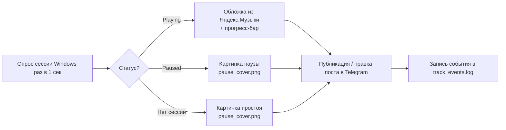

<div align="center">
🎧 YaMusicToTelegram
Автопостинг текущего трека из Яндекс.Музыки в Telegram-канал
Обложка • Прогресс-бар • Статус паузы • Без Python и сторонних пакетов


</div>
---
📖 Содержание
О проекте
Возможности
Как это выглядит
Требования
Установка
Настройка
⚠️ Перед публикацией на GitHub
Структура файлов
Как это работает
Устранение проблем
Лицензия
---
📌 О проекте
`YaMusicToTelegram` — PowerShell-скрипт для Windows, который следит за тем, что сейчас играет в Яндекс.Музыке, и автоматически публикует это в Telegram-канал: обложка, артист, название, альбом, живой прогресс-бар с таймером. При смене трека старый пост удаляется и публикуется новый.
Определение трека — через встроенный в Windows WinRT Media API (тот же механизм, что рисует медиа-оверлей при нажатии Fn-клавиш громкости). Никакого Python, winsdk или сторонних пакетов — только чистый PowerShell.
✨ Возможности
🎵 Автоопределение трека — через системный WinRT Media API Windows
🖼 Обложка и точная длительность — подтягиваются из каталога `api.music.yandex.net`
▶️ Живой прогресс-бар с таймером, который обновляется прямо в посте
⏸ Отдельное состояние паузы — публикуется своя картинка вместо обложки
🔇 Отдельное состояние простоя — когда плеер закрыт или ничего не играет
🧾 Лог событий (`track_events.log`) — старт трека, пауза, возобновление, сброс таймера
🛡 Защита от `429 Too Many Requests` — ограничение частоты правок + корректная обработка `retry_after`
🖱 Отключение QuickEdit Mode консоли — случайный клик по окну больше не ставит скрипт «на паузу»
⏱ Таймауты на все HTTP-запросы — скрипт не виснет при проблемах сети
🖼 Как это выглядит
Состояние	Что в посте
▶️ Играет	Обложка трека, артист — название, альбом, прогресс-бар, таймер
⏸ Пауза	Своя картинка (`pause_cover.png`), артист — название, без прогресс-бара
🔇 Ничего не играет	Та же картинка, что и для паузы, с соответствующей подписью
🧰 Требования
Windows 10/11
PowerShell 5.1 (уже встроен в Windows) или PowerShell 7+
Яндекс.Музыка — десктопное приложение или веб/UWP, лишь бы сессия была видна системному медиа-центру Windows
Telegram-бот, добавленный администратором в канал с правом публикации сообщений
🚀 Установка
Скачайте `YaMusicToTelegram.ps1` и `pause_cover.png` в одну папку.
Создайте бота через @BotFather → получите токен вида `123456789:AAA...`.
Добавьте бота администратором в канал (обязательно право «Публиковать сообщения»).
Узнайте `chat_id` канала — перешлите любое сообщение из канала боту @userinfobot, либо откройте `https://api.telegram.org/bot<ТОКЕН>/getUpdates` после того, как в канал придёт новое сообщение. Для каналов `chat_id` обычно отрицательный и начинается с `-100`.
Впишите токен и `chat_id` — см. Настройку ниже.
Запустите:
```powershell
   powershell -ExecutionPolicy Bypass -File YaMusicToTelegram.ps1
   ```
⚙️ Настройка
Все пользовательские настройки — в блоке `НАСТРОЙКИ` в начале файла, строки 21–33.
<table>
<tr><th>Строка</th><th>Параметр</th><th>Описание</th></tr>
<tr>
<td align="center"><b>22</b></td>
<td><code>$TelegramBotToken</code></td>
<td>🔑 Токен вашего бота от BotFather<br><code>$TelegramBotToken = "123456789:AAExxxxxxxxxxxxxxxxxxxxxxxxxxxxxxxxx"</code></td>
</tr>
<tr>
<td align="center"><b>23</b></td>
<td><code>$TelegramChatId</code></td>
<td>💬 Id канала для публикации<br><code>$TelegramChatId = "-1001234567890"</code></td>
</tr>
<tr>
<td align="center">26</td>
<td><code>$AppNameFilter</code></td>
<td>По этой подстроке скрипт находит нужную медиа-сессию среди всех, что видит Windows. Менять не нужно при использовании десктопного приложения Яндекс.Музыки</td>
</tr>
<tr>
<td align="center">30</td>
<td><code>$PauseImagePath</code></td>
<td>Путь к картинке для паузы/простоя — по умолчанию <code>pause_cover.png</code> рядом со скриптом</td>
</tr>
</table>
> **Только строки 22 и 23 обязательны** для запуска — без них скрипт не заработает. Остальные параметры (25, 27–29, 31–32) технические, с пояснением прямо в комментариях рядом; трогать не обязательно.
⚠️ Перед публикацией на GitHub
> [!CAUTION]
> Токен бота — это полноценный пароль от него. Любой, кто увидит его в публичном репозитории, сможет постить и удалять сообщения от имени вашего бота.
Замените строки 22–23 на плейсхолдеры перед коммитом:
```powershell
   $TelegramBotToken = "ВАШ_ТОКЕН_ОТ_BOTFATHER"
   $TelegramChatId   = "ВАШ_CHAT_ID"
   ```
Если токен уже где-то «засветился» — отзовите его через `@BotFather` → `/revoke` и выпустите новый. Просто заменить значение в скрипте недостаточно.
Добавьте в `.gitignore` файлы, которые скрипт создаёт сам во время работы:
```gitignore
   last_message_id.txt
   track_events.log
   ```
Более безопасный вариант — не хранить токен в самом скрипте, а брать его из переменной окружения:
```powershell
$TelegramBotToken = $env:YAMUSIC_BOT_TOKEN
$TelegramChatId   = $env:YAMUSIC_CHAT_ID
```
Тогда сам файл можно публиковать вообще без правок — значения задаются в системе перед запуском.
📁 Структура файлов
```
📦 YaMusicToTelegram
 ┣ 📜 YaMusicToTelegram.ps1   ← сам скрипт
 ┣ 🖼 pause_cover.png          ← картинка для паузы/простоя (обязательна)
 ┣ 📄 last_message_id.txt      ← создаётся автоматически: id текущего поста
 ┗ 📄 track_events.log         ← создаётся автоматически: лог событий
```
⚡ Как это работает

Раз в секунду скрипт спрашивает Windows, какой трек активен в сессии, подходящей под `$AppNameFilter`.
Определяется состояние: Playing / Paused / Idle.
При смене трека или входе/выходе из паузы — старый пост удаляется, публикуется новый, событие пишется в лог, таймер сбрасывается (на паузе — «замораживается»).
Пока трек тот же — пост не пересоздаётся, а раз в `$CaptionUpdateIntervalSeconds` секунд правится подпись с прогресс-баром.
Картинка паузы/простоя грузится в Telegram один раз, дальше переиспользуется её `file_id` — без повторной загрузки файла.
🔧 Устранение проблем
<details>
<summary><b>429 Too Many Requests</b></summary><br>
Telegram ограничивает частоту правок одного сообщения. Увеличьте `$CaptionUpdateIntervalSeconds` (строка 32), например до `8`–`10`.
</details>
<details>
<summary><b>Скрипт «зависает»</b></summary><br>
Чаще всего это не зависание, а Windows-консоль ставит процесс на паузу при клике мышкой по окну (QuickEdit Mode). Скрипт отключает этот режим сам при запуске; если всё равно происходит — не кликайте по окну консоли во время работы.
</details>
<details>
<summary><b>Нет обложки трека</b></summary><br>
Яндекс.Музыка не нашла трек по запросу «артист + название» в своём каталоге (редкий ремикс, неточно указан артист). Пост в этом случае публикуется без картинки.
</details>
<details>
<summary><b>«Ни одна сессия не подошла под фильтр»</b></summary><br>
Windows видит медиа-сессию, но её `SourceAppUserModelId` не содержит `yandex`. Включите `$VerboseLog = $true` (строка 28) — в консоли появится список всех найденных сессий, и `$AppNameFilter` можно поправить под конкретный случай.
</details>
📄 Лицензия
MIT — используйте, меняйте, распространяйте свободно.
---
<div align="center">
Сделано для тех, кто хочет делиться музыкой из Яндекс.Музыки в Telegram ✨
</div>
